# Credit Risk Modeling

A production-grade credit risk modeling pipeline implementing **Probability of Default (PD)**, **Loss Given Default (LGD)**, **Exposure at Default (EAD)**, credit scorecard development, macroeconomic stress testing, and **Basel III regulatory capital** calculations.

---

## Project Overview

This project builds a complete credit risk analytics framework from the ground up:

| Component | Description |
|-----------|-------------|
| **Data Generation** | Synthetic portfolio of 50,000 consumer loans with realistic correlations |
| **EDA** | 6+ diagnostic visualizations with statistical summaries |
| **Feature Engineering** | 35+ features including ratios, interactions, and log transforms |
| **PD Models** | Logistic Regression, Random Forest, Gradient Boosting, XGBoost |
| **LGD Model** | Gradient Boosting with logit-transformed beta-distributed target |
| **EAD Model** | Credit Conversion Factor (CCF) approach per Basel framework |
| **Credit Scorecard** | WoE/IV-based scorecard with PDO scaling (300-850 range) |
| **Model Validation** | ROC/AUC, KS, Gini, PSI, calibration, lift, gains charts |
| **Stress Testing** | 4 macroeconomic scenarios (baseline through deep depression) |
| **Regulatory Capital** | Basel III IRB capital formula with Vasicek ASRF model |
| **Thesis PDF** | Auto-generated 20-page thesis with embedded charts |

---

## Project Structure

```
credit-risk-model/
├── main.py                      # Run the complete pipeline
├── generate_thesis_pdf.py       # Generate thesis/documentation PDF
├── config.py                    # Configuration & hyperparameters
├── requirements.txt             # Python dependencies
├── README.md
├── src/
│   ├── __init__.py
│   ├── data_generator.py        # Synthetic data with latent variable model
│   ├── eda.py                   # Exploratory Data Analysis & plots
│   ├── feature_engineering.py   # Feature pipeline (scaling, encoding, transforms)
│   ├── pd_model.py              # PD model suite (4 algorithms)
│   ├── lgd_model.py             # Loss Given Default model
│   ├── ead_model.py             # Exposure at Default / CCF model
│   ├── scorecard.py             # WoE credit scorecard
│   ├── validation.py            # 9-panel validation dashboard
│   ├── stress_testing.py        # Macroeconomic stress scenarios
│   └── capital.py               # Basel III IRB capital calculator
├── output/
│   ├── figures/                 # All generated charts (15+ PNGs)
│   ├── models/                  # Model comparison results
│   └── data/                    # Dataset & summary statistics
└── docs/
    └── Credit_Risk_Modeling_Thesis.pdf
```

---

## Quick Start

### 1. Install Dependencies

```bash
pip install -r requirements.txt
```

### 2. Run the Full Pipeline

```bash
python main.py
```

This single command executes all 10 stages and generates:
- 15+ publication-quality figures in `output/figures/`
- Model results in `output/models/`
- Complete dataset in `output/data/`
- 20-page thesis PDF in `docs/`

### 3. Generate Only the Thesis PDF

```bash
python generate_thesis_pdf.py
```

---

## Pipeline Stages

### Stage 1: Data Generation
Generates 50,000 synthetic loan records using a **latent variable model** where default probability is driven by:
- **Borrower features**: FICO score, income, employment length, home ownership
- **Credit history**: utilization, delinquencies, inquiries, public records
- **Loan terms**: amount, rate, term, purpose, DTI ratio
- **Macro variables**: GDP growth, unemployment, fed funds rate, house price index

### Stage 2: Exploratory Data Analysis
Produces diagnostic visualizations including:
- Default rate distribution (count & percentage)
- Feature distributions segmented by default status
- Correlation heatmap of 20+ features
- FICO score analysis with default rate by score band
- Macroeconomic sensitivity analysis
- Loan purpose default rate comparison

### Stage 3: Feature Engineering
Creates 15+ derived features:
- **Ratios**: loan-to-income, balance-to-income, payment-to-income
- **Interactions**: FICO x utilization, FICO x DTI
- **Transforms**: log(income), log(loan), log(balance)
- **Indicators**: high utilization flag, delinquency flag
- **Economic**: real interest rate (nominal - GDP growth)

### Stage 4: PD Model Training
Trains and compares four models with 5-fold stratified cross-validation:

| Model | Key Hyperparameters |
|-------|-------------------|
| Logistic Regression | C=0.1, L2, balanced weights |
| Random Forest | 300 trees, depth=8, leaf=50 |
| Gradient Boosting | 200 trees, lr=0.05, depth=4 |
| XGBoost | 300 trees, lr=0.05, L1+L2 reg |

### Stage 5: Model Validation
Nine-panel validation dashboard covering:
- ROC curve (train vs test)
- Precision-Recall curve
- Kolmogorov-Smirnov chart
- Calibration plot
- Score distribution by class
- Confusion matrix (at optimal threshold)
- Cumulative gains chart
- Lift chart (by decile)
- Population Stability Index (PSI)

### Stage 6: Credit Scorecard
WoE-based scorecard with:
- Information Value (IV) ranking of all features
- Points-to-Double-Odds (PDO) scaling: base 600, PDO=20
- Rating grades: AAA through D
- Score range: 300-850

### Stage 7-8: LGD & EAD Models
- **LGD**: Gradient Boosting with logit-transformed target on defaulted loans
- **EAD**: Credit Conversion Factor model: `EAD = Drawn + CCF x (Limit - Drawn)`

### Stage 9: Stress Testing
Four macroeconomic scenarios with second-order effects:

| Scenario | GDP Shock | Unemployment | Rate Shock |
|----------|-----------|-------------|------------|
| Baseline | 0% | 0% | 0% |
| Mild Recession | -2% | +3% | +1% |
| Severe Recession | -5% | +7% | +2.5% |
| Deep Depression | -10% | +12% | +4% |

### Stage 10: Basel III Capital
IRB capital calculation using:
- Vasicek asymptotic single-risk-factor (ASRF) model
- 99.9% confidence level
- Asset correlation function: `R(PD)`
- Maturity adjustment: 2.5 years
- Capital components: CET1 (4.5%), Tier 1 (6%), Total (8%), Conservation Buffer (2.5%)

---

## Key Equations

**Expected Loss:**
```
EL = PD x LGD x EAD
```

**Basel IRB Capital:**
```
Conditional PD = Phi[(Phi^-1(PD) + sqrt(R) * Phi^-1(0.999)) / sqrt(1-R)]
K = [LGD * Conditional_PD - PD * LGD] * Maturity_Adjustment
RWA = K * 12.5 * EAD
```

**Credit Score:**
```
Score = Offset + Factor * ln((1-PD)/PD)
Factor = PDO / ln(2)
Offset = BaseScore - Factor * ln(TargetOdds)
```

---

## Output Files
Below are the visualizations and reports generated by the pipeline:

### 1. Target Variable Analysis
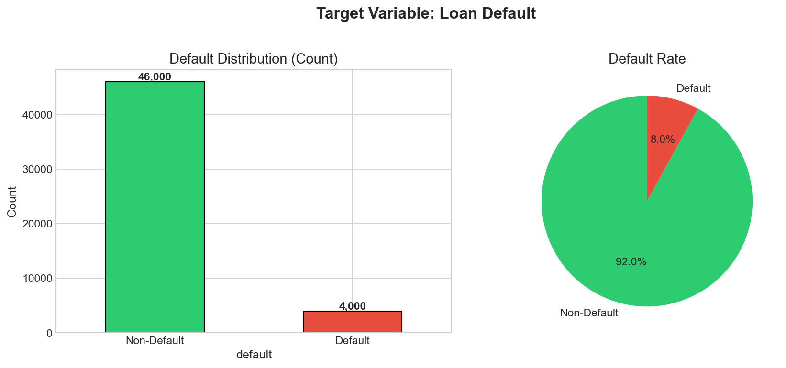

### 2. Feature Distributions by Default
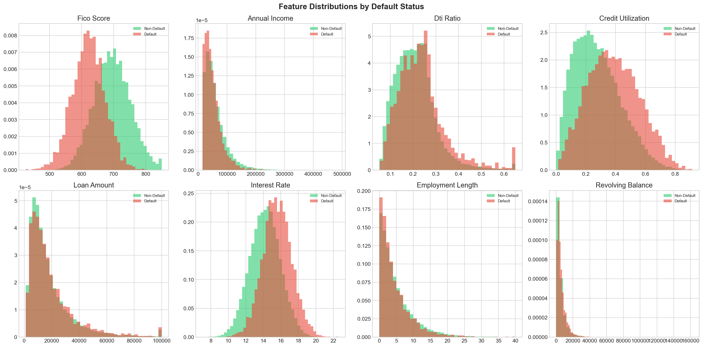

### 3. Feature Correlation Heatmap
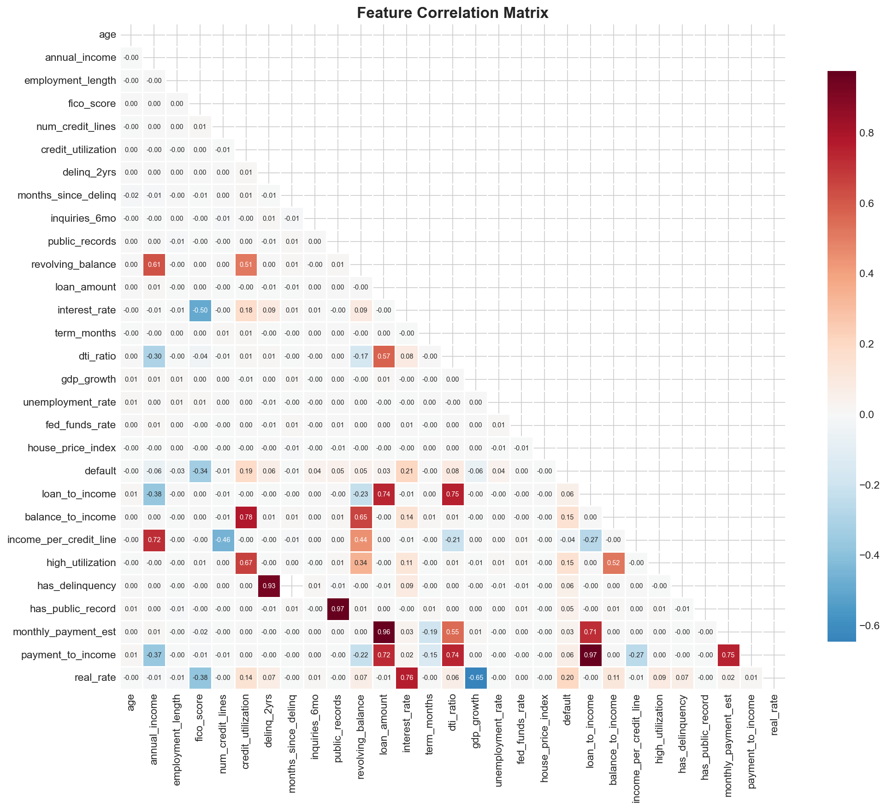

### 4. FICO Score Deep-Dive
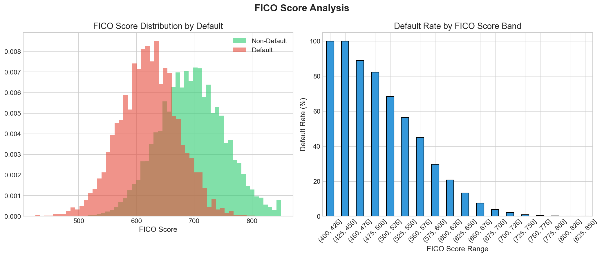

### 5. Macroeconomic Sensitivity
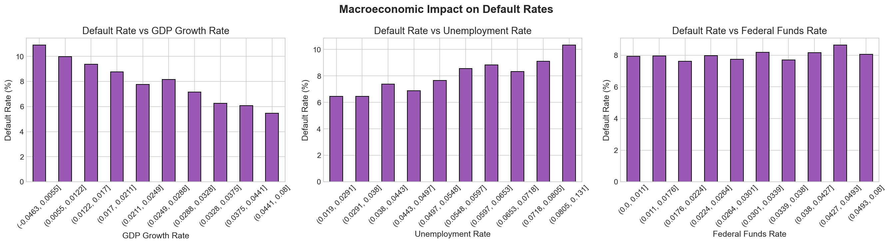

### 6. Purpose-Based Analysis
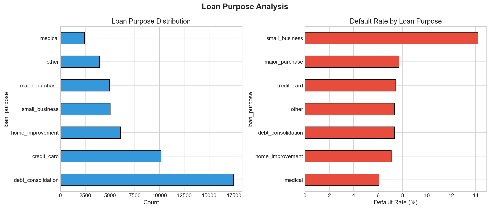

### 7. PD Model CV Comparison
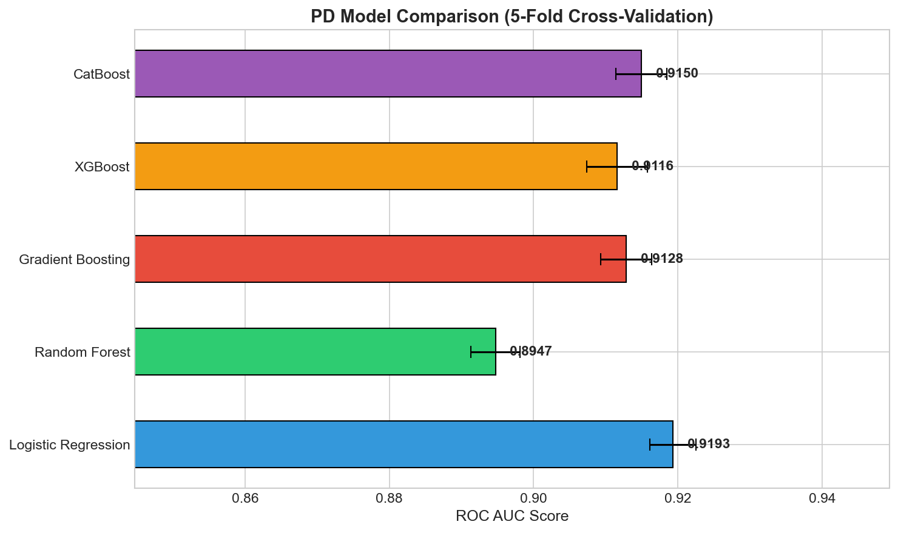

### 8. Feature Importances (RF & XGBoost)
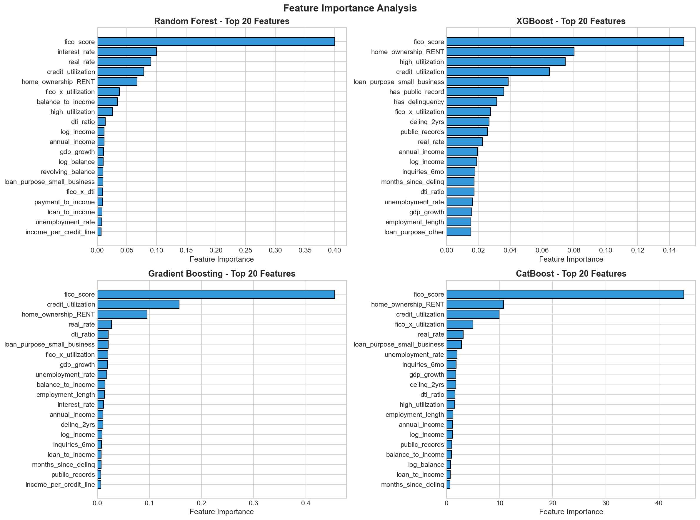

### 9. Validation Dashboard (9-Panel)
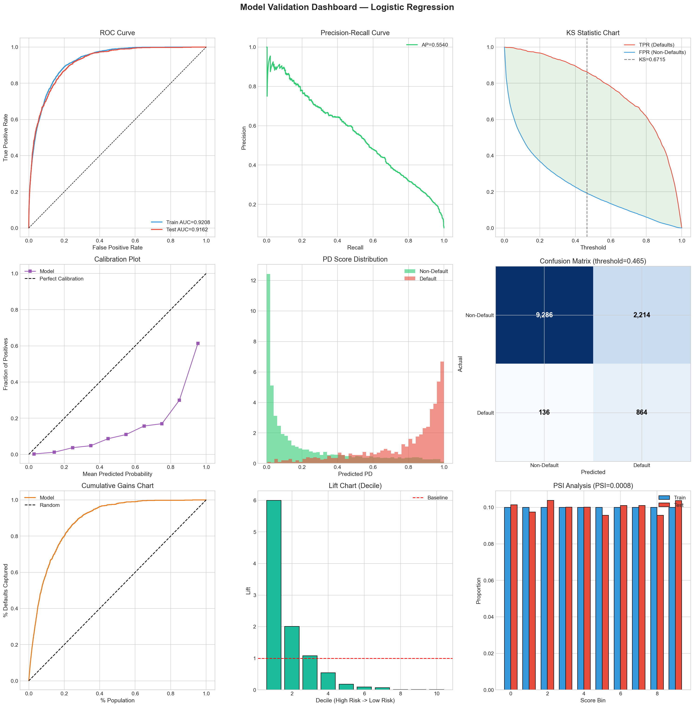

### 10. Risk Decile Calibration
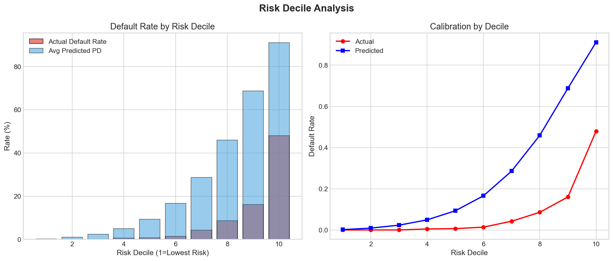

### 11. Credit Scorecard Results
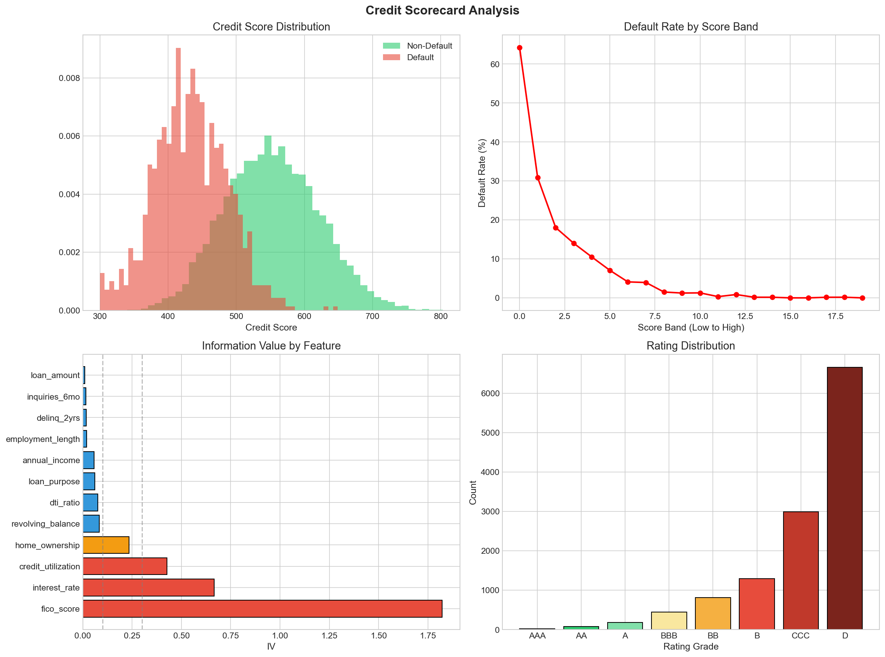

### 12. LGD Model Diagnostics
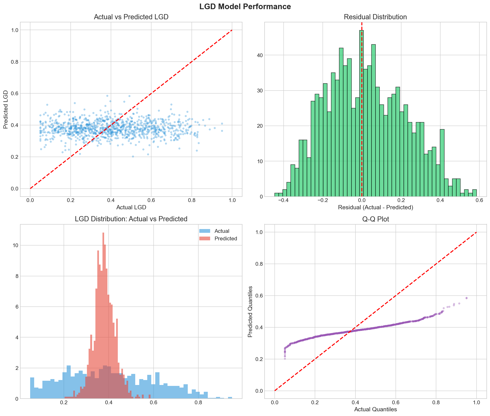

### 13. EAD/CCF Model Results
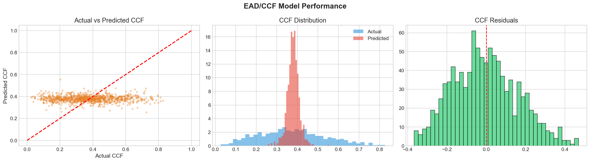

### 14. Stress Test Scenarios
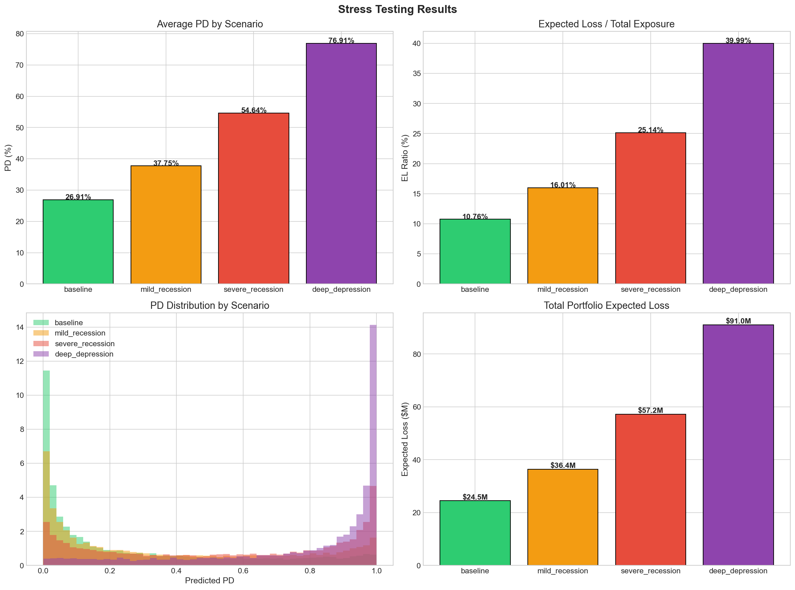

### 15. Basel III Capital Breakdown
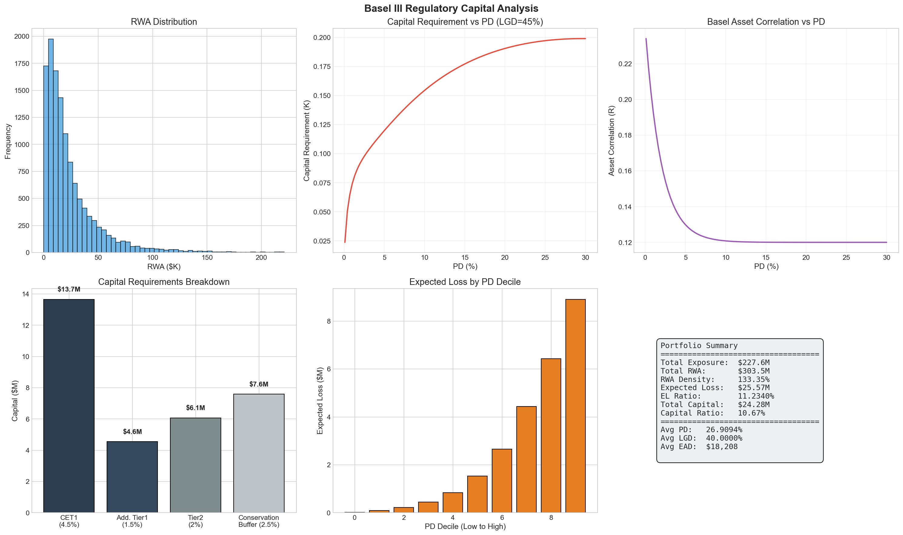

---

## Dependencies

- Python 3.9+
- numpy, pandas, scipy, statsmodels
- scikit-learn, xgboost
- matplotlib, seaborn
- reportlab, Pillow

---

## References

1. Merton, R.C. (1974). On the pricing of corporate debt. *Journal of Finance*.
2. Basel Committee (2006). International Convergence of Capital Measurement.
3. Basel Committee (2010). Basel III: Global regulatory framework.
4. Vasicek, O.A. (2002). The distribution of loan portfolio value. *Risk*.
5. Chen, T. & Guestrin, C. (2016). XGBoost. *KDD*.
6. Altman, E.I. (1968). Financial ratios and corporate bankruptcy. *Journal of Finance*.
7. Thomas, L.C. (2009). Consumer Credit Models. Oxford University Press.

---

## License

This project is for educational and research purposes.
